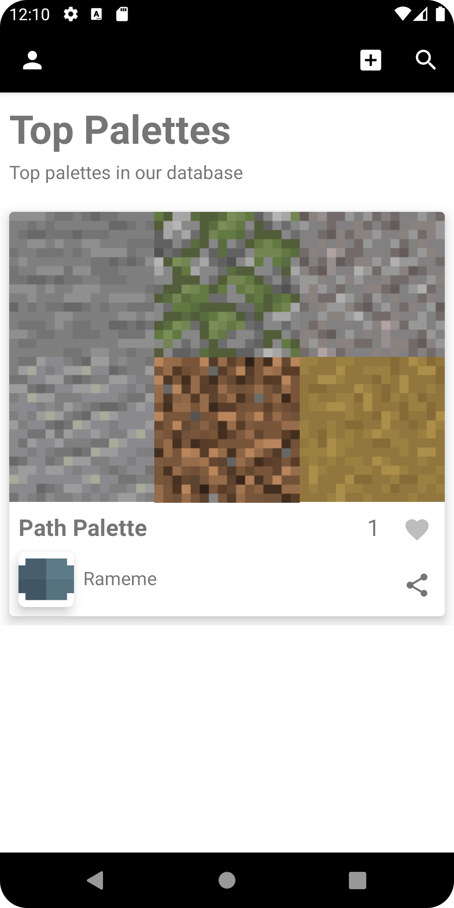
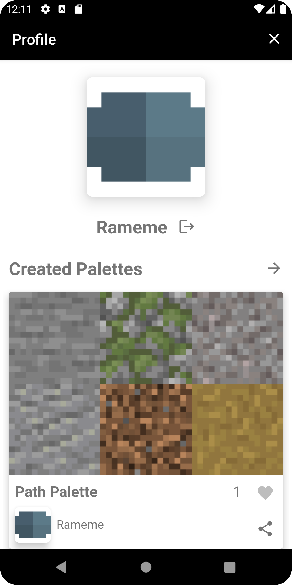
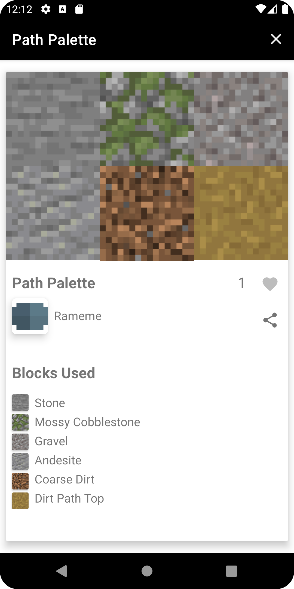
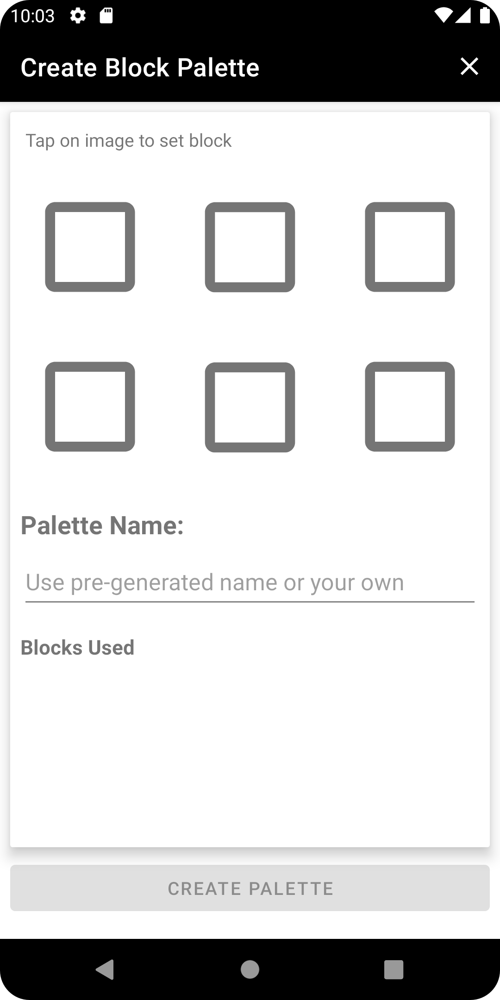

# Block Picker
Ever trying to make a build in Minecraft and you just can't find the perfect color palette? Block Picker will help jumpstart your creativity and inspire others! Choose any 6 blocks and put them in a palette that you can share or save for later. Having trouble still? Scroll through other palettes for ideas! This simple app is perfect for any Minecraft builder.

# Play Store
> Closed Testing

# Webstie
[Block Picker](https://rameme.github.io/block-picker-website/)

# Screenshots
Top Palette | Profile | Palette | Create Palette |
:-------------------------:|:-------------------------:|:-------------------------:|:-------------------------:|
 |  |  | 

# Author
- Name: Ramim 
- Github: [https://github.com/rameme](https://github.com/rameme)

# Credits
This application is inspired by [Block Palette](https://www.blockpalettes.com/) by [Nate Boland](https://twitter.com/ntbol)

### NOT OFFICIAL MINECRAFT PRODUCT. NOT APPROVED BY OR ASSOCIATED WITH MOJANG